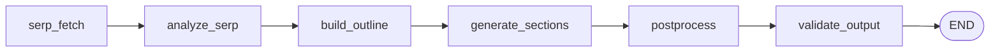

# SEO Article Generator

A FastAPI backend that accepts a topic and returns a fully structured, SEO-validated article. It queries the top 10 Google SERP results, extracts keyword intent and competitor patterns via LLM analysis, builds a word-budgeted outline, generates each section independently, then runs 10 programmatic SEO constraint checks — all in a crash-recoverable LangGraph pipeline with async SQLite checkpointing.

**Stack:** FastAPI · LangGraph · Claude Sonnet (claude-sonnet-4-6) · SerpAPI · SQLite

---

## Quick Start

```bash
# From the repo root
cd seo_agent

python -m venv .venv
source .venv/bin/activate        # Windows: .venv\Scripts\activate
pip install -r requirements.txt

cp .env.example .env             # open .env and add your ANTHROPIC_API_KEY
uvicorn main:app --reload --port 8000
```

Interactive API docs: http://localhost:8000/docs

`jobs.db` and `checkpoints.db` are created automatically on first server start — no manual DB setup required.

---

## Pipeline

```
serp_fetch → analyze_serp → build_outline → generate_sections → postprocess → validate_output
```



### Node Reference

Nodes communicate exclusively through `ArticleState` (a LangGraph `TypedDict`). No node calls another node directly.

| Node | Description | Notes |
|---|---|---|
| `serp_fetch` | Fetches top-10 Google SERP results and People Also Ask questions for the topic | **API call** (SerpAPI). Supports a built-in mock (10 results + 5 PAA questions) via `use_mock: true` — no API key needed. |
| `analyze_serp` | Extracts primary keyword, secondary keywords, search intent, and competitor H2 patterns from SERP results | **LLM** (claude-sonnet-4-6, temp=0). Uses structured output (`SerpAnalysis`). Keyword extraction is folded in here — no separate parse step. |
| `build_outline` | Produces the full article outline: H1, meta title, meta description, section headings, word budgets, internal links, and external references | **LLM** (claude-sonnet-4-6, temp=0.2). Uses structured output (`ArticleOutline`). Word budgets are scaled to 93% of target to account for LLM overshoot. |
| `generate_sections` | Writes the body content for each section in the outline | **LLM** (claude-sonnet-4-6, temp=0.7). One call per section. Uses an append reducer (`operator.add`) so checkpoint replay accumulates rather than overwrites sections. |
| `postprocess` | Assembles the full article body, computes keyword density, and generates FAQ items from PAA questions | **Rule-based** assembly + **LLM** for FAQ only (claude-sonnet-4-6, temp=0.3, structured output). |
| `validate_output` | Runs 10 deterministic SEO checks and attaches results + overall score to the article | **Rule-based only** (regex + arithmetic). No LLM involved. |

---

## Architecture

### LangGraph: Pipeline Orchestration and Shared State

The pipeline is built on [LangGraph](https://github.com/langchain-ai/langgraph), a framework for authoring stateful, multi-step LLM workflows as directed graphs. Each of the six pipeline stages is an independent node — a plain Python function with no knowledge of any other node. All communication happens through a single shared state object (`ArticleState`), a typed dictionary that every node reads from and writes to. This gives the pipeline three important properties:

- **Clean separation of concerns** — nodes are independently testable and replaceable without touching the rest of the graph.
- **No implicit coupling** — adding, removing, or reordering a node requires only a change to `graph/builder.py`, not to any node's implementation.
- **Transparent data flow** — `ArticleState` serves as the single source of truth; every field produced or consumed by a node is declared there.

### LangGraph Checkpointing: Thread IDs, Polling, and Crash Recovery

Every pipeline run is assigned a unique `thread_id`. LangGraph's `AsyncSqliteSaver` writes the full `ArticleState` to `checkpoints.db` after each node completes, keyed by this thread ID. This enables three capabilities that would otherwise require significant custom infrastructure:

- **Job polling** — because each node completion is checkpointed, the application can read the latest checkpoint event to determine which stage the pipeline is currently at and surface that as `execution_stage` in the status API.
- **Crash recovery** — if the server restarts or a node raises an unhandled exception mid-run, calling `POST /jobs/{thread_id}/resume` re-enters the graph at the last successfully completed node. LangGraph determines the resumption point automatically from the checkpoint — no manual state reconstruction needed.
- **Idempotent replay** — the `generated_sections` field uses an append reducer (`Annotated[List[str], operator.add]`) rather than the default overwrite. On replay, already-generated sections accumulate rather than being lost, making the node safe to re-enter.

### Two SQLite Databases

Two databases are kept deliberately separate:

| Database | Managed by | What it stores |
|---|---|---|
| `checkpoints.db` | LangGraph (`AsyncSqliteSaver`) | Full `ArticleState` snapshots after each node — internal to LangGraph |
| `jobs.db` | Application | Job status, current execution stage, error messages, and the final article as a JSON blob |

The application never reads LangGraph's internal checkpoint schema. On pipeline completion, the final state is serialised to JSON once and written to `jobs.db`. All subsequent status and result API calls read exclusively from `jobs.db`. This separation means the application layer is insulated from any changes to LangGraph's checkpoint format, and `jobs.db` can be queried, backed up, or replicated independently.

### Rule-Based SEO Validation

The final pipeline node (`validate_output`) runs 10 SEO checks using only regex and arithmetic — no LLM is involved. This is an intentional design choice: SEO constraints like meta title length, keyword density, and heading hierarchy are deterministic rules with clear pass/fail conditions. Delegating these checks to an LLM would introduce unnecessary non-determinism and risk hallucinated results (e.g., an LLM reporting a check as passed when it isn't). Rule-based validation gives:

- **Consistent, reproducible scores** — the same article always produces the same result.
- **Cheap and fast checks** — no API calls, no latency, no cost.
- **Auditable failures** — each check produces a specific detail message explaining exactly why it failed.

These checks are also natural candidates for conversion into LLM tool calls in future iterations, where the LLM could use them to self-evaluate and revise its output.

### Extension: Automatic Revision Loop

The current pipeline always runs `validate_output → END`. A natural extension is to make this conditional: if `overall_score` falls below a threshold, route back to `generate_sections` to revise the article before finalising. `graph/builder.py` contains a commented-out `add_conditional_edges` call that would enable this. The append reducer on `generated_sections` already makes re-entry into that node idempotent, so no state management changes would be required.

### Content Grounding via SERP Results

All content generation nodes (`build_outline`, `generate_sections`, `postprocess`) are grounded in real competitor data fetched in the first two nodes: `serp_fetch` pulls the top-10 Google results and People Also Ask questions for the topic, and `analyze_serp` distils these into a structured `SerpAnalysis` (primary keyword, secondary keywords, search intent, competitor H2 patterns) that flows through the rest of the pipeline. This avoids generating generic content disconnected from what actually ranks for the topic.

The current SERP source is SerpAPI (with a built-in mock for development). This layer is isolated in `services/serp_client.py` and can be swapped for or supplemented by other sources — Tavily, Exa, or a direct Google Custom Search integration — without any changes to the pipeline nodes.

---

## Project Structure

```
seo_agent/
├── main.py                       # FastAPI app — lifespan, 4 endpoints, run_graph()
├── requirements.txt
├── .env.example                  # Environment variable template (copy to .env)
│
├── graph/
│   ├── builder.py                # Wires 6 nodes into a compiled StateGraph
│   ├── state.py                  # ArticleState TypedDict — shared contract between all nodes
│   └── nodes/
│       ├── serp_fetch.py         # Node 1: SerpAPI wrapper or mock
│       ├── analyze_serp.py       # Node 2: LLM → SerpAnalysis (structured output)
│       ├── build_outline.py      # Node 3: LLM → ArticleOutline (structured output)
│       ├── generate_sections.py  # Node 4: LLM free-form, one call per section
│       ├── postprocess.py        # Node 5: assemble article body + FAQ generation
│       └── validate_output.py    # Node 6: 10 SEO checks, no LLM
│
├── models/
│   ├── inputs.py                 # JobRequest, JobResponse, JobStatusResponse
│   ├── serp.py                   # SerpData, SerpResult, PeopleAlsoAsk
│   ├── outline.py                # SerpAnalysis, ArticleOutline, OutlineSection, links
│   └── article.py                # ArticleOutput, KeywordAnalysis, ValidationResult, FAQItem
│
├── prompts/
│   ├── analyze_serp.py           # System + user prompt builders for Node 2
│   ├── build_outline.py          # System + user prompt builders for Node 3
│   └── generate_section.py       # System + user prompt builders for Node 4
│
├── services/
│   └── serp_client.py            # SerpAPI call + 10-result mock with PAA questions
│
├── db/
│   └── jobs.py                   # SQLite helpers: init_jobs_db, create_job, update_job, get_job
│
└── tests/
    ├── test_seo_constraints.py   # 12 SEO validation tests
    └── fixtures/
        └── sample_output.json    # Pre-generated ArticleOutput for offline testing
```

---

## Setup

### Prerequisites

| Requirement | Notes |
|---|---|
| Python 3.11+ | |
| Anthropic API key | Requires access to `claude-sonnet-4-6` |
| SerpAPI key | Optional — use `use_mock: true` in requests to skip |

### Installation

```bash
cd seo_agent

# Create and activate virtual environment
python -m venv .venv
source .venv/bin/activate        # Windows: .venv\Scripts\activate

# Install dependencies
pip install -r requirements.txt

# Configure environment variables
cp .env.example .env
# Open .env and fill in your API keys
```

### Environment Variables

| Variable | Required | Description |
|---|---|---|
| `ANTHROPIC_API_KEY` | **Yes** | API key for Claude (claude-sonnet-4-6) |
| `SERPAPI_KEY` | No\* | SerpAPI key for live Google SERP data |
| `LANGCHAIN_TRACING_V2` | No | Set to `true` to enable LangSmith tracing |
| `LANGCHAIN_API_KEY` | No | LangSmith API key (required if tracing enabled) |
| `LANGCHAIN_PROJECT` | No | LangSmith project name for grouping traces |

\* Not required when `use_mock: true` is set in the job request.

---

## Running the Server

```bash
uvicorn main:app --reload --port 8000
```

Interactive API docs: **http://localhost:8000/docs**

On first startup:
- `jobs.db` is created automatically by `init_jobs_db()` in the lifespan handler
- `checkpoints.db` is created automatically by LangGraph's `AsyncSqliteSaver`

Both files are gitignored and should not be committed.

---

## Live Demo

A Jupyter notebook walkthrough is available at [`demo.ipynb`](demo.ipynb). It covers:

- **Project structure** — annotated folder tree with descriptions of each component
- **Pipeline diagram** — rendered Mermaid graph pulled directly from the compiled LangGraph
- **Node reference** — table of all 6 nodes with roles and design notes
- **Live run** — submits a real job to the running server, polls stage-by-stage with elapsed timings, and fetches the full result
- **Results walkthrough** — inspects article content, keyword analysis, internal links, external references, FAQ, and the validation scorecard

To run the notebook, start the server first (`uvicorn main:app --reload --port 8000` from `seo_agent/`), then open `demo.ipynb` and run all cells.

---

## API Reference

### POST /jobs — Submit a Job

Accepts a topic and generation parameters. Returns a `thread_id` immediately (`202 Accepted`). The pipeline runs in the background via FastAPI `BackgroundTasks`.

**Request body:**

| Field | Type | Default | Description |
|---|---|---|---|
| `topic` | string | required | Article topic or search keyword |
| `target_word_count` | int | `1500` | Target article length |
| `language` | string | `"en"` | ISO 639-1 language code |
| `use_mock` | bool | `false` | Skip SerpAPI; use built-in mock SERP data |

```python
import requests

response = requests.post(
    "http://localhost:8000/jobs",
    json={
        "topic": "best productivity tools for remote teams",
        "target_word_count": 1500,
        "language": "en",
        "use_mock": True,   # set False with a real SERPAPI_KEY
    },
)
response.raise_for_status()
data = response.json()
thread_id = data["thread_id"]
print(f"Submitted: {thread_id}  status={data['status']}")
```

Response (`202 Accepted`):
```json
{ "thread_id": "3f8a2c1d-...", "status": "pending" }
```

---

### GET /jobs/{thread_id} — Poll Status

Returns current job status and the name of the pipeline node that most recently completed. Poll this endpoint until `status` is `completed` or `failed`.

**Status lifecycle:** `pending` → `running` → `completed` | `failed`

**`execution_stage` values** (in order): `serp_fetch` · `analyze_serp` · `build_outline` · `generate_sections` · `postprocess` · `validate_output`

The `result_preview` field (first 300 characters of `body_markdown`) becomes populated after `postprocess` completes — useful for confirming the article is generating sensible content before the full result is ready.

```python
import requests, time

def poll_until_done(thread_id: str, interval: float = 5.0) -> dict:
    url = f"http://localhost:8000/jobs/{thread_id}"
    while True:
        resp = requests.get(url)
        resp.raise_for_status()
        job = resp.json()
        print(f"  stage={job.get('execution_stage') or '—':25}  status={job['status']}")
        if job["status"] in ("completed", "failed"):
            return job
        time.sleep(interval)

result = poll_until_done(thread_id)
```

Response example (mid-run):
```json
{
  "thread_id": "3f8a2c1d-...",
  "status": "running",
  "execution_stage": "generate_sections",
  "topic": "best productivity tools for remote teams",
  "created_at": "2025-03-10 12:00:00",
  "updated_at": "2025-03-10 12:00:45",
  "error_message": null,
  "result_preview": null
}
```

---

### GET /jobs/{thread_id}/result — Fetch the Article

Returns the full `ArticleOutput` once `status` is `completed`. Returns `409 Conflict` if the job is still running or has failed.

```python
import requests

resp = requests.get(f"http://localhost:8000/jobs/{thread_id}/result")
resp.raise_for_status()   # raises 409 if not yet completed
article = resp.json()

print(article["h1"])
print(f"Word count : {article['word_count']}")
print(f"SEO score  : {article['validation_results']['overall_score']}/100")
```

---

### POST /jobs/{thread_id}/resume — Resume a Failed Job

Re-enters the graph from the last LangGraph checkpoint. Valid for jobs with status `failed` or stale `running`. LangGraph determines the resumption point automatically from `checkpoints.db` — no configuration needed.

```python
import requests

resp = requests.post(f"http://localhost:8000/jobs/{thread_id}/resume")
resp.raise_for_status()
print(resp.json())   # {"thread_id": "...", "status": "running"}
```

---

### End-to-End Example

```python
import requests, time

BASE = "http://localhost:8000"

def generate_article(topic: str, word_count: int = 1500, use_mock: bool = True) -> dict:
    # 1. Submit job
    resp = requests.post(f"{BASE}/jobs", json={
        "topic": topic,
        "target_word_count": word_count,
        "use_mock": use_mock,
    })
    resp.raise_for_status()
    thread_id = resp.json()["thread_id"]
    print(f"Submitted: {thread_id}")

    # 2. Poll until done
    while True:
        resp = requests.get(f"{BASE}/jobs/{thread_id}")
        resp.raise_for_status()
        job = resp.json()
        print(f"  [{job.get('execution_stage') or '—'}]  {job['status']}")
        if job["status"] == "completed":
            break
        if job["status"] == "failed":
            raise RuntimeError(f"Job failed: {job['error_message']}")
        time.sleep(5)

    # 3. Fetch result
    resp = requests.get(f"{BASE}/jobs/{thread_id}/result")
    resp.raise_for_status()
    return resp.json()


article = generate_article("best productivity tools for remote teams")
print(f"\nH1    : {article['h1']}")
print(f"Words : {article['word_count']}")
print(f"Score : {article['validation_results']['overall_score']}/100")
```

---

## Output Schema

The `/result` endpoint returns a single `ArticleOutput` object:

| Field | Type | Description |
|---|---|---|
| `thread_id` | string | Job identifier |
| `h1` | string | Article H1 title (contains primary keyword) |
| `meta_title` | string | SEO meta title (50-60 chars) |
| `meta_description` | string | SEO meta description (150-160 chars) |
| `body_markdown` | string | Full article with `##` H2 and `###` H3 headings |
| `word_count` | int | Actual word count of the generated body |
| `keyword_analysis` | object | Primary + secondary keyword density breakdown |
| `internal_links` | array | 3-5 internal link suggestions with anchor text and target topic |
| `external_references` | array | 2-4 citation placements with source name, URL, and section hint |
| `faq` | array | FAQ items generated from People Also Ask questions |
| `validation_results` | object | 10 SEO check results + `overall_score` (0-100) |

```json
{
  "thread_id": "3f8a2c1d-...",
  "h1": "Best Productivity Tools for Remote Teams in 2025",
  "meta_title": "Best Productivity Tools for Remote Teams 2025",
  "meta_description": "Discover the top productivity tools for remote teams — from async communication to project tracking. Reviewed and ranked for distributed workflows in 2025.",
  "body_markdown": "# Best Productivity Tools for Remote Teams in 2025\n\n## Why Remote Teams Need the Right Tools\n\n...",
  "word_count": 1487,
  "keyword_analysis": {
    "primary_keyword": "productivity tools for remote teams",
    "primary_keyword_count": 14,
    "keyword_density": 0.0094,
    "secondary_keywords": [
      {
        "keyword": "remote collaboration software",
        "count": 6,
        "sections_present": ["Communication Tools", "Project Management"]
      }
    ]
  },
  "internal_links": [
    {
      "anchor_text": "async communication guide",
      "suggested_target_topic": "asynchronous communication best practices",
      "context_hint": "mention in the communication section"
    }
  ],
  "external_references": [
    {
      "source_name": "Harvard Business Review",
      "source_url": "https://hbr.org/...",
      "placement_section": "Why Remote Teams Need the Right Tools",
      "relevance_note": "remote work productivity research"
    }
  ],
  "faq": [
    {
      "question": "What tools do remote teams use to stay productive?",
      "answer": "Remote teams typically use a combination of project management platforms..."
    }
  ],
  "validation_results": {
    "passed": true,
    "overall_score": 90,
    "checks": [
      { "check_name": "meta_title_length", "passed": true, "detail": "Meta title is 47 characters (target: 50-60)." }
    ]
  }
}
```

---

## SEO Validation

Node 6 (`validate_output`) runs 10 deterministic SEO checks using only regex and arithmetic — no LLM involved. Results are attached to `validation_results` on the `ArticleOutput`. The test suite validates the same checks against a pre-generated fixture.

| Check | Pass Condition | Method |
|---|---|---|
| `meta_title_length` | 50-60 characters | `len()` |
| `meta_description_length` | 150-160 characters | `len()` |
| `primary_keyword_in_h1` | Keyword appears (case-insensitive) in H1 | `str.lower()` + `in` |
| `word_count_within_10pct` | Within ±10% of `target_word_count` | Arithmetic |
| `single_h1` | Exactly one `# ` heading | `re.findall(r'^# [^\n]+', ..., re.MULTILINE)` |
| `no_h3_without_h2` | No `### ` heading before first `## ` | Line-by-line scan |
| `internal_links_count` | 3-5 links | `len()` |
| `external_references_count` | 2-4 references | `len()` |
| `keyword_density` | 0.5%-2.5% of total words | `primary_count / word_count` |
| `faq_present` | ≥3 FAQ items | `len()` |

`overall_score` = percentage of checks passed (0-100).

---

## Tests

```bash
cd seo_agent
pytest tests/ -v
```

Tests run against `tests/fixtures/sample_output.json` — a pre-generated `ArticleOutput`. No running server or API calls required.

| Test | What It Checks |
|---|---|
| `test_meta_title_length` | Meta title is 50-60 characters |
| `test_meta_description_length` | Meta description is 150-160 characters |
| `test_primary_keyword_in_h1` | Primary keyword appears in H1 |
| `test_keyword_density_in_range` | Keyword density between 0.5%-2.5% |
| `test_single_h1` | Exactly one H1 heading in body |
| `test_no_h3_without_h2` | Valid heading hierarchy (no orphaned H3) |
| `test_internal_links_count` | 3-5 internal link suggestions |
| `test_external_references_count` | 2-4 external references |
| `test_faq_not_empty` | At least 3 FAQ items present |
| `test_faq_items_have_answers` | All FAQ items have non-empty question and answer |
| `test_validation_results_attached` | `validation_results` field is present and not None |
| `test_validation_score_reasonable` | `overall_score` ≥70 |

---

## Extension Points

**Revision loop** — `graph/builder.py` contains a commented-out `add_conditional_edges` call. Replacing the `validate_output → END` edge with a conditional that routes back to `generate_sections` when `overall_score` is below a threshold would enable automatic revision until all SEO checks pass. The `operator.add` reducer on `generated_sections` already makes this idempotent.

**Per-section DDGS search** — `serp_fetch` could be extended with a DuckDuckGo search phase for more targeted per-section content grounding. Currently omitted due to scraper fragility (~10s added latency per article, no uptime guarantee).

**LangSmith tracing** — Set `LANGCHAIN_TRACING_V2=true` and `LANGCHAIN_API_KEY` in `.env` to stream full node-level execution traces to LangSmith. No code changes required; the `lifespan` pattern is already compatible.
